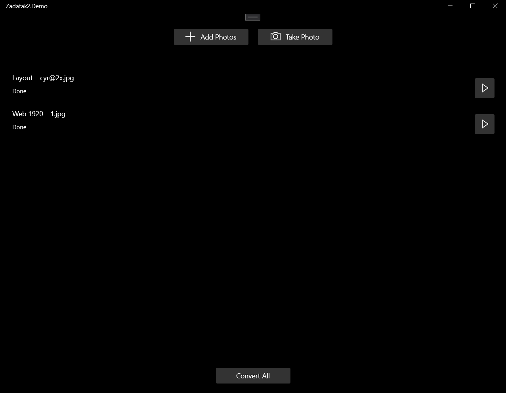
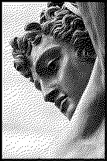

# UWP

Aplikacija implementira [Floyd-Steinberg dithering](https://en.wikipedia.org/wiki/Floyd%E2%80%93Steinberg_dithering) algoritam. Ima jednostavan interfejs prikazan na slici ispod.

Nakon pritiska na *Convert All* dugme, potrebno je izabrati dirkektorijum u koji ce biti snimljene slike. Izvorna slika (lijevo) i rezultujaca slika(desno) su prikazane ispod.

